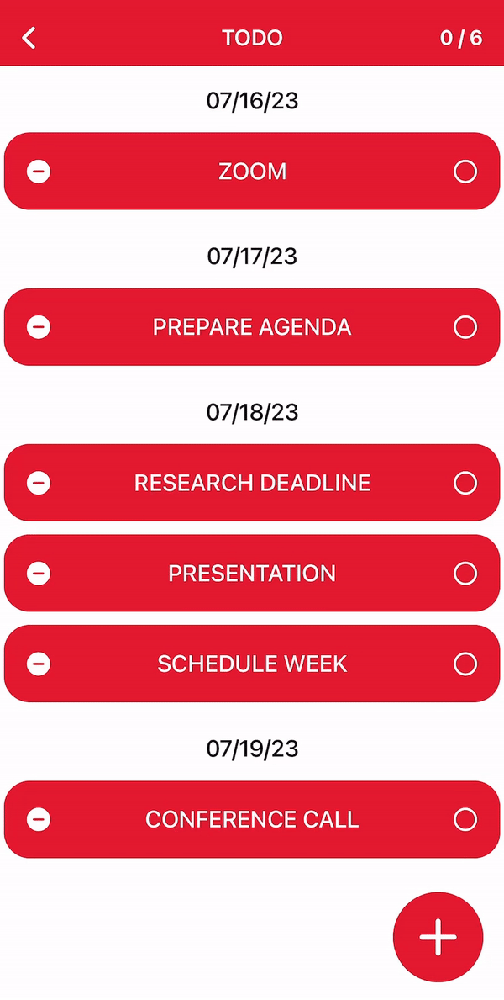

# To-Do App 

##  Description
The To-Do App is a simple yet stylish app built with Swift and Core Data. It is designed to help users stay organized and effortlessly keep track of tasks. 

## Key Features 
- Tracks progress within each category to assess and measure overall productivity. 
- Manages appointments, deadlines, and tasks for prioritization of current and future obligations.
- Easily removes and modifies categories and to-do items to ensure accuracy and relevance.
- Maintains focus on the most important tasks by automatically moving completed tasks to the bottom of each sub-list.

## Demo
### Add + Delete

### Edit 

### Complete 

## Technologies 
- SwiftUI
- MVVM

## Requirements 
- IOS 16 +
